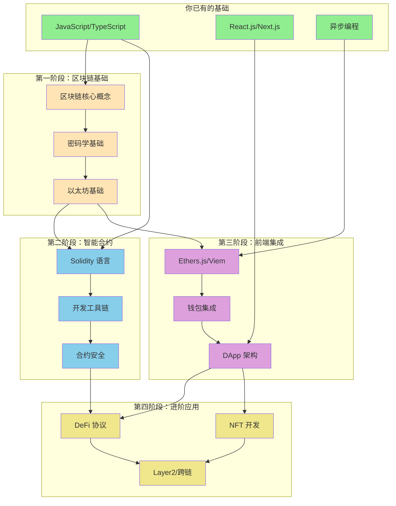

# Web3 开发学习路线图

## 1. 前置知识检查

作为前端开发工程师，你已经具备：

| 已掌握 ✅ | 需要补充 ⚠️ | 需要新学 ❌ |
|-----------|-------------|-------------|
| JavaScript/TypeScript | 密码学基础 | Solidity 智能合约 |
| React.js/Next.js | 计算机网络(P2P) | 区块链原理 |
| 异步编程(Promise/async) | 基础经济学概念 | 以太坊虚拟机(EVM) |
| NPM/包管理 | | Web3.js/Ethers.js |
| API 调用 | | 钱包集成 |
| 状态管理 | | DeFi/NFT 协议 |

---

## 2. 学习路径依赖图



---

## 3. 每个大类的 20% 核心知识（产生 80% 效果）

### 📦 第一阶段：区块链基础

#### 20% 核心知识点：
| 核心概念 | 重要程度 | 学习时间 |
|---------|---------|---------|
| 区块、交易、哈希的关系 | ⭐⭐⭐⭐⭐ | 2小时 |
| 公钥/私钥/地址的生成原理 | ⭐⭐⭐⭐⭐ | 2小时 |
| Gas 费用机制 | ⭐⭐⭐⭐⭐ | 1小时 |
| 账户模型(EOA vs 合约账户) | ⭐⭐⭐⭐ | 1小时 |

#### 3.1 原子化问题：

```
【区块链核心】
Q1: 一个区块包含哪些关键字段？区块哈希是如何计算的？
Q2: 为什么说区块链是"不可篡改"的？篡改一个历史交易需要什么代价？
Q3: 什么是 Merkle Tree？它如何验证某笔交易存在于区块中？

【密码学基础】
Q4: 私钥 → 公钥 → 地址 的推导过程是什么？为什么不可逆？
Q5: 数字签名的作用是什么？如何验证一笔交易是由某地址发起的？
Q6: 什么是 Keccak256？它和 SHA256 有什么区别？

【以太坊基础】
Q7: EOA 和合约账户有什么区别？各自能做什么、不能做什么？
Q8: Gas、Gas Price、Gas Limit 分别是什么？一笔交易的实际花费如何计算？
Q9: 什么是 Nonce？它解决什么问题？
Q10: EIP-1559 对 Gas 机制做了什么改变？Base Fee 和 Priority Fee 是什么？
```

#### 3.2 可跳过的 80%：
- ❌ 共识算法的数学证明（PoW/PoS 深度原理）
- ❌ 椭圆曲线密码学的数学推导
- ❌ 比特币 UTXO 模型（以太坊用账户模型）
- ❌ 区块链分叉的详细历史
- ❌ 各种共识算法对比（PBFT、DPoS等）

---

### 📦 第二阶段：智能合约开发

#### 20% 核心知识点：
| 核心概念 | 重要程度 | 学习时间 |
|---------|---------|---------|
| Solidity 基础语法（变量、函数、可见性） | ⭐⭐⭐⭐⭐ | 4小时 |
| 存储(storage) vs 内存(memory) | ⭐⭐⭐⭐⭐ | 2小时 |
| ERC20/ERC721 标准 | ⭐⭐⭐⭐⭐ | 3小时 |
| Hardhat/Foundry 基本使用 | ⭐⭐⭐⭐⭐ | 3小时 |
| 常见安全漏洞（重入、溢出） | ⭐⭐⭐⭐ | 2小时 |

#### 3.1 原子化问题：

```
【Solidity 语法】
Q11: public/private/internal/external 四种可见性有什么区别？
Q12: view 和 pure 函数有什么区别？为什么调用它们不消耗 Gas？
Q13: mapping 和 array 在 Solidity 中有什么区别？各自适合什么场景？
Q14: 什么是 modifier？如何用它实现权限控制？
Q15: constructor 和普通函数有什么区别？合约部署时发生了什么？

【存储模型】
Q16: storage、memory、calldata 三种数据位置有什么区别？
Q17: 为什么修改 storage 变量比 memory 变量贵得多？
Q18: Solidity 中的 struct 默认存储在哪里？如何显式指定？

【代币标准】
Q19: ERC20 的核心函数有哪些？transfer 和 transferFrom 有什么区别？
Q20: 什么是 approve + transferFrom 模式？为什么需要这种设计？
Q21: ERC721 和 ERC20 的主要区别是什么？tokenId 的作用是什么？
Q22: 什么是 ERC1155？它解决了什么问题？

【开发工具】
Q23: Hardhat 的 hardhat.config.js 中必须配置哪些内容？
Q24: 如何用 Hardhat 部署合约到测试网？需要哪些步骤？
Q25: 什么是 ABI？它在前端调用合约时起什么作用？

【安全基础】
Q26: 什么是重入攻击？如何防止？
Q27: Checks-Effects-Interactions 模式是什么？为什么重要？
Q28: 整数溢出在 Solidity 0.8+ 之后还需要担心吗？
```

#### 3.2 可跳过的 80%：
- ❌ 汇编(Yul)优化
- ❌ 代理合约升级模式（初期）
- ❌ Gas 极致优化技巧
- ❌ 形式化验证
- ❌ MEV 防护（高级话题）
- ❌ EVM 操作码详解

---

### 📦 第三阶段：前端集成（你的主战场 🎯）

#### 20% 核心知识点：
| 核心概念 | 重要程度 | 学习时间 |
|---------|---------|---------|
| Ethers.js / Viem 基础 | ⭐⭐⭐⭐⭐ | 3小时 |
| 钱包连接（wagmi + RainbowKit） | ⭐⭐⭐⭐⭐ | 2小时 |
| 合约读取 vs 写入 | ⭐⭐⭐⭐⭐ | 2小时 |
| 交易状态处理 | ⭐⭐⭐⭐⭐ | 2小时 |
| 事件监听与解析 | ⭐⭐⭐⭐ | 2小时 |

#### 3.1 原子化问题：

```
【Web3 库】
Q29: Provider 和 Signer 有什么区别？什么操作需要 Signer？
Q30: 如何用 ethers.js 读取一个 ERC20 代币的余额？
Q31: 如何用 ethers.js 调用合约的写入函数并等待确认？
Q32: Viem 和 Ethers.js 的主要区别是什么？为什么新项目推荐 Viem？

【钱包集成】
Q33: wagmi 的 useAccount、useConnect、useDisconnect 各自作用是什么？
Q34: 如何检测用户是否已连接钱包？如何获取当前连接的地址？
Q35: 如何处理用户切换账户或切换网络的情况？
Q36: 什么是 WalletConnect？它和浏览器插件钱包有什么区别？

【交易处理】
Q37: 一笔交易从发起到确认经历哪些状态？前端如何展示这些状态？
Q38: 如何估算一笔交易需要多少 Gas？
Q39: 交易失败的常见原因有哪些？如何向用户展示友好的错误信息？
Q40: 什么是交易哈希？如何用它查询交易状态？

【事件系统】
Q41: 智能合约的 Event 是什么？为什么需要它？
Q42: 如何用 ethers.js 监听合约事件？
Q43: 如何查询历史事件（过去的 Transfer 记录）？
Q44: indexed 参数在事件中有什么作用？
```

#### 3.2 可跳过的 80%：
- ❌ 自己实现钱包连接逻辑（用 wagmi）
- ❌ Web3.js（旧库，用 ethers/viem）
- ❌ 自建节点/RPC
- ❌ ENS 深度集成（初期）
- ❌ 账户抽象(AA)实现细节

---

### 📦 第四阶段：进阶应用

#### 20% 核心知识点：
| 核心概念 | 重要程度 | 学习时间 |
|---------|---------|---------|
| Uniswap 核心概念（AMM） | ⭐⭐⭐⭐⭐ | 3小时 |
| NFT 铸造与元数据 | ⭐⭐⭐⭐⭐ | 2小时 |
| IPFS/Arweave 存储 | ⭐⭐⭐⭐ | 2小时 |
| Layer2 基础（Arbitrum/Optimism） | ⭐⭐⭐⭐ | 2小时 |

#### 3.1 原子化问题：

```
【DeFi 基础】
Q45: 什么是 AMM（自动做市商）？它和传统订单簿有什么区别？
Q46: Uniswap 的 x*y=k 公式是什么意思？价格如何决定？
Q47: 什么是滑点？为什么大额交易滑点更高？
Q48: 什么是无常损失？流动性提供者为什么要承担这个风险？

【NFT 开发】
Q49: NFT 的元数据(metadata)通常包含什么？存储在哪里？
Q50: 什么是 tokenURI？它返回什么格式的数据？
Q51: 如何实现一个支持白名单的 NFT 铸造合约？
Q52: 什么是 Reveal 机制？为什么 NFT 项目常用它？

【存储】
Q53: IPFS 的 CID 是什么？为什么说它是内容寻址的？
Q54: 如何将 NFT 图片上传到 IPFS？推荐什么服务？
Q55: IPFS 和 Arweave 有什么区别？各自适合什么场景？

【Layer2】
Q56: 什么是 Layer2？它如何解决以太坊扩容问题？
Q57: Optimistic Rollup 和 ZK Rollup 的主要区别是什么？
Q58: 用户如何将资产从 L1 转移到 L2？
```

#### 3.2 可跳过的 80%：
- ❌ 复杂 DeFi 协议（借贷、衍生品）
- ❌ MEV、闪电贷套利
- ❌ ZK 证明数学原理
- ❌ 跨链桥实现原理
- ❌ 治理代币经济模型设计

---

## 📚 推荐学习资源

### 按优先级排序：

```
【第一优先级 - 直接上手】
1. CryptoZombies（边玩边学 Solidity）: https://cryptozombies.io
2. Wagmi 官方文档: https://wagmi.sh
3. Scaffold-ETH 2（全栈模板）: https://scaffoldeth.io

【第二优先级 - 深入理解】
4. Solidity by Example: https://solidity-by-example.org
5. Ethers.js 文档: https://docs.ethers.org
6. Patrick Collins 的免费课程: https://www.youtube.com/watch?v=gyMwXuJrbJQ

【第三优先级 - 参考】
7. OpenZeppelin 合约库: https://docs.openzeppelin.com
8. Ethereum 官方文档: https://ethereum.org/developers
```

---

## 🎯 建议学习路径（时间估算）

```
Week 1-2: 区块链基础 + Solidity 语法
          ↓ 产出：完成 CryptoZombies
        
Week 3-4: Hardhat + 简单合约
          ↓ 产出：部署一个 ERC20 到测试网
        
Week 5-6: 前端集成（wagmi + RainbowKit）
          ↓ 产出：一个可以连接钱包、读写合约的 Next.js DApp
        
Week 7-8: NFT 项目实战
          ↓ 产出：完整的 NFT 铸造网站
        
Week 9+:  DeFi 基础 + 持续深入
```

你的前端基础非常扎实，第三阶段会是你上手最快的部分！建议从 Scaffold-ETH 2 开始，它已经帮你整合好了 Next.js + wagmi + Hardhat 的完整栈。