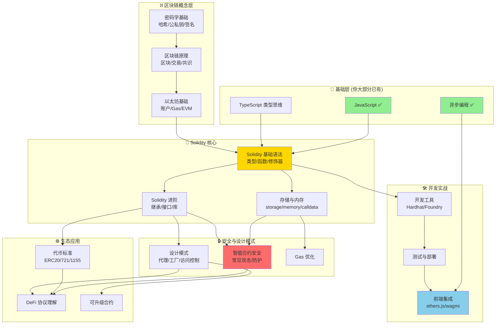

# Solidity 开发学习路径

## 1. 前置知识检查

作为前端开发工程师，让我评估你的知识储备：

### ✅ 你已具备的基础
| 知识领域 | 你的储备 | 对 Solidity 的帮助 |
|---------|---------|-------------------|
| JavaScript | ✅ 精通 | Solidity 语法有相似性 |
| 异步编程 | ✅ 掌握 | 理解区块链交互 |
| JSON 操作 | ✅ 掌握 | ABI 理解无障碍 |
| 包管理 (npm) | ✅ 熟悉 | 工具链使用顺畅 |
| TypeScript | 可能掌握 | 强类型思维迁移 |

### ⚠️ 需要补充的知识
| 知识领域 | 重要程度 | 说明 |
|---------|---------|------|
| 区块链基础概念 | 🔴 必须 | 理解执行环境 |
| 密码学基础 | 🟡 重要 | 哈希、签名、地址 |
| 以太坊机制 | 🔴 必须 | Gas、EVM、账户模型 |
| 静态类型语言经验 | 🟡 重要 | 如有 TypeScript 则 ✅ |

---

## 2. 学习路径依赖图



---

## 3. 每个大类的 20% 核心知识（产生 80% 效果）

### 📦 3.1 区块链概念层 - 核心 20%

| 核心概念 | 为什么重要 |
|---------|-----------|
| 哈希函数特性 | 理解地址生成、数据完整性 |
| 公私钥与签名 | 理解交易授权、账户控制 |
| Gas 机制 | 直接影响合约设计 |
| 账户类型 (EOA vs 合约) | 理解调用逻辑 |
| 交易生命周期 | 理解状态变更 |

#### 🎯 原子化问题

```
Q1: 为什么哈希函数是"单向"的？这对区块链有什么意义？
Q2: 私钥、公钥、地址之间的推导关系是什么？
Q3: 什么是 Gas？Gas Price 和 Gas Limit 分别是什么？
Q4: EOA 和合约账户的本质区别是什么？谁能主动发起交易？
Q5: 一笔交易从发送到确认，经历了哪些状态？
Q6: 为什么以太坊要用账户模型而不是 UTXO？
Q7: nonce 在交易中的作用是什么？
```

#### ⏭️ 可跳过的 80%
- 共识算法细节 (PoW/PoS 实现原理)
- 默克尔树的完整实现
- P2P 网络层协议
- 区块结构的完整字段
- 各种共识机制对比

---

### 📝 3.2 Solidity 基础语法 - 核心 20%

| 核心概念 | 为什么重要 |
|---------|-----------|
| 值类型 vs 引用类型 | 避免 99% 的新手错误 |
| storage/memory/calldata | 理解数据位置和 Gas 成本 |
| 函数可见性 | 安全性基础 |
| msg.sender / msg.value | 最常用的全局变量 |
| modifier | 权限控制的核心 |
| event | 前端交互必备 |

#### 🎯 原子化问题

```
Q1: uint256 和 int256 的区别？为什么 Solidity 默认用 uint？
Q2: string 是值类型还是引用类型？
Q3: storage 变量赋值给 memory 变量时发生了什么？
Q4: public 和 external 函数的区别？哪个更省 Gas？
Q5: 为什么 view 函数不消耗 Gas（被外部调用时）？
Q6: modifier 中的 _; 代表什么？可以有多个吗？
Q7: event 为什么不能在合约内读取？
Q8: msg.sender 在合约 A 调用合约 B 时，B 中的 msg.sender 是谁？
Q9: payable 关键字的作用是什么？
Q10: constructor 可以被继承吗？
```

#### ⏭️ 可跳过的 80%
- 所有 fixed point 数字类型 (几乎没人用)
- 内联汇编的复杂操作
- 所有底层类型转换规则
- 旧版本语法 (< 0.8.0)
- function selector 的手动计算

---

### 📝 3.3 Solidity 进阶 - 核心 20%

| 核心概念 | 为什么重要 |
|---------|-----------|
| 继承与 override | 代码复用标准做法 |
| interface | 与其他合约交互必备 |
| abstract contract | 理解 OpenZeppelin |
| error (自定义错误) | 现代错误处理 |
| receive/fallback | 接收 ETH 的机制 |

#### 🎯 原子化问题

```
Q1: 多重继承时，函数冲突如何解决？C3 线性化是什么？
Q2: interface 和 abstract contract 的区别？
Q3: virtual 和 override 必须成对出现吗？
Q4: 自定义 error 比 require 字符串省 Gas 的原理？
Q5: receive() 和 fallback() 的触发条件分别是什么？
Q6: 为什么 interface 中的函数必须是 external？
Q7: super 关键字在多重继承中指向谁？
```

#### ⏭️ 可跳过的 80%
- using for 的高级用法
- library 的 delegatecall 细节
- 函数重载的边界情况
- 继承中 storage layout 的复杂规则

---

### 🔒 3.4 智能合约安全 - 核心 20%

| 核心攻击/防护 | 为什么重要 |
|-------------|-----------|
| 重入攻击 | 历史上损失最大的漏洞类型 |
| 整数溢出 | 0.8.0 前的头号杀手 |
| 访问控制缺失 | 最常见的逻辑漏洞 |
| tx.origin 误用 | 钓鱼攻击入口 |
| 检查-效果-交互模式 | 核心防御模式 |

#### 🎯 原子化问题

```
Q1: 重入攻击的原理是什么？为什么 call 比 transfer 更危险？
Q2: Checks-Effects-Interactions 模式如何防止重入？
Q3: Solidity 0.8.0 如何处理整数溢出？还需要 SafeMath 吗？
Q4: tx.origin 和 msg.sender 的区别？为什么不应该用 tx.origin 做权限检查？
Q5: 为什么应该使用 pull 模式而不是 push 模式发送 ETH？
Q6: delegatecall 的安全风险是什么？
Q7: 什么是 selfdestruct 的安全隐患？
Q8: 私有变量真的"私有"吗？如何读取？
```

#### ⏭️ 可跳过的 80%
- 形式化验证
- 模糊测试 (fuzz testing) 高级技巧
- MEV 相关的复杂攻击
- 复杂的闪电贷攻击变种
- 特定 DeFi 协议的历史漏洞细节

---

### 🛠️ 3.5 开发工具链 - 核心 20%

| 核心工具/概念 | 为什么重要 |
|-------------|-----------|
| Hardhat 基础配置 | 主流开发框架 |
| 编写测试 | 合约质量保证 |
| 部署脚本 | 上线必备 |
| ethers.js 基础 | 前端集成 |
| 网络配置 | 多环境部署 |

#### 🎯 原子化问题

```
Q1: hardhat.config.js 中必须配置哪些项？
Q2: 如何在测试中获取不同的签名者 (signer)？
Q3: describe/it/beforeEach 的组织方式是什么？
Q4: ethers.parseEther() 和 ethers.formatEther() 分别做什么？
Q5: 如何在测试中模拟时间流逝？
Q6: 部署到测试网需要什么？如何获取测试 ETH？
Q7: ABI 是什么？在哪里找到它？
Q8: 如何验证已部署的合约源码？
```

#### ⏭️ 可跳过的 80%
- Foundry 的 Rust 语法细节
- 自定义 Hardhat task
- 插件开发
- CI/CD 流水线配置
- 多签部署流程

---

### 🌐 3.6 代币标准与生态 - 核心 20%

| 核心标准 | 为什么重要 |
|---------|-----------|
| ERC20 | 同质化代币标准 |
| ERC721 | NFT 标准 |
| OpenZeppelin 库 | 不要重复造轮子 |
| 代理模式基础 | 可升级合约入门 |

#### 🎯 原子化问题

```
Q1: ERC20 的 approve + transferFrom 两步模式解决什么问题？
Q2: ERC20 的 decimals() 返回 18 意味着什么？
Q3: ERC721 的 tokenId 有什么特点？
Q4: ownerOf() vs balanceOf() 在 ERC721 中的区别？
Q5: 为什么要用 OpenZeppelin 而不是自己写？
Q6: 透明代理模式的核心思想是什么？
Q7: 代理合约中，storage 冲突是什么问题？
Q8: 什么是 ERC1155？它解决了什么问题？
```

#### ⏭️ 可跳过的 80%
- ERC777 (几乎被弃用)
- EIP 提案的完整流程
- 所有代理模式的变种细节
- 复杂治理代币机制

---

### 🖥️ 3.7 前端集成 - 核心 20%（你的优势领域）

| 核心技能 | 为什么重要 |
|---------|-----------|
| wagmi + viem | React 生态首选 |
| 钱包连接 | 用户入口 |
| 合约读写 | 核心交互 |
| 交易状态处理 | 用户体验 |
| 事件监听 | 实时更新 |

#### 🎯 原子化问题

```
Q1: useAccount, useConnect, useDisconnect 分别做什么？
Q2: useContractRead 和 useContractWrite 的区别？
Q3: 如何处理交易的 pending/success/error 状态？
Q4: 如何监听合约事件并更新 UI？
Q5: 为什么要用 viem 而不是 ethers.js（在新项目中）？
Q6: 如何处理不同网络的切换？
Q7: 如何显示交易 hash 并链接到区块浏览器？
Q8: BigInt 在前端如何正确显示和计算？
```

#### ⏭️ 可跳过的 80%
- 手动实现钱包连接
- 底层 JSON-RPC 调用
- 多钱包适配器的实现细节
- 旧版 web3.js API

---

## 📚 推荐学习顺序

```
Week 1-2: 区块链概念 + Solidity 基础语法
Week 3-4: Solidity 进阶 + 开发工具 (Hardhat)
Week 5-6: 安全基础 + ERC 标准实战
Week 7-8: 前端集成 (wagmi) + 完整 DApp 项目
```

## 🎯 第一个实战项目建议

**简单的 NFT Minting DApp**
- 包含：ERC721 合约 + React 前端 + 钱包连接 + Mint 功能
- 覆盖：核心语法、测试、部署、前端集成全流程
- 复杂度适中，成就感强